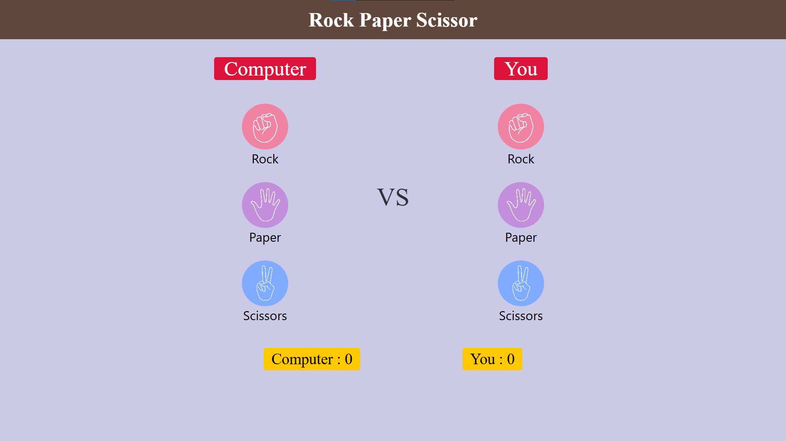
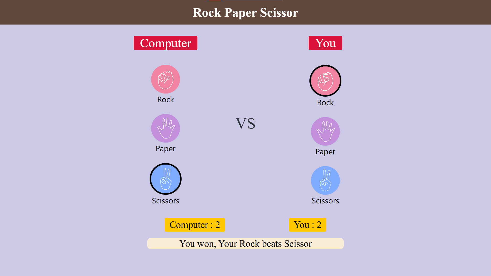
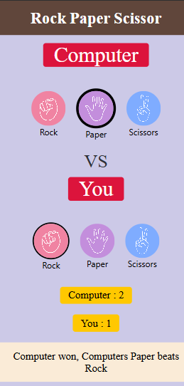

<div align="center">
  <h1>✊ 🖐️ ✌️ Rock Paper Scissors (Web Version)</h1>
  <p>A classic game brought to the browser, built entirely from scratch.</p>
  
  
  
  
</div>

<br />

## 🎮 About The Project

This is a clean, interactive, web-based version of the classic **Rock, Paper, Scissors** game. It was 100% hand-written from scratch without the use of AI generators, showcasing core front-end development skills. 

> **Did you know?** I also built a Command Line Interface (CLI) version of this game in C! You can check it out here: [rock-paper-scissors-c](https://github.com/Vaibhav-bhavsarr/rock-paper-scissors-c) 

## ✨ Features

* **Interactive UI**: Engaging hover effects and click animations to highlight the user's choices.
* **Real-time Score Tracking**: Dynamically keeps track of the Player and Computer scores.
* **Dynamic Feedback**: Displays custom, real-time messages declaring the winner of each round.
* **Pure Vanilla Tech**: Built with raw HTML, CSS, and JavaScript. No external libraries or frameworks required.

## 🚀 Live Demo

> **[Play the game here!](https://vaibhav-bhavsarr.github.io/rock-paper-scissors-web/)** 

### 📸 Screenshots


<br>

<br>


## 💻 Tech Stack

* **HTML5**: For the structure and layout.
* **CSS3**: For custom styling, Flexbox layout management, and visual cues.
* **Vanilla JavaScript**: For the underlying game logic, DOM manipulation, event listeners, and randomized computer selections.

## 🛠️ How to Run Locally

To run and play this game on your own machine, follow these simple steps:

1. Clone this repository to your local machine:
   ```bash
   git clone https://github.com/Vaibhav-bhavsarr/rock-paper-scissors-web
2. Open the newly downloaded project folder on your computer.
3. Right-click the index.html file, select Open with, and choose your favorite web browser (like Google Chrome, Firefox, or Microsoft Edge). Alternatively, you can drag and drop the index.html file directly into an open browser tab to start playing!
